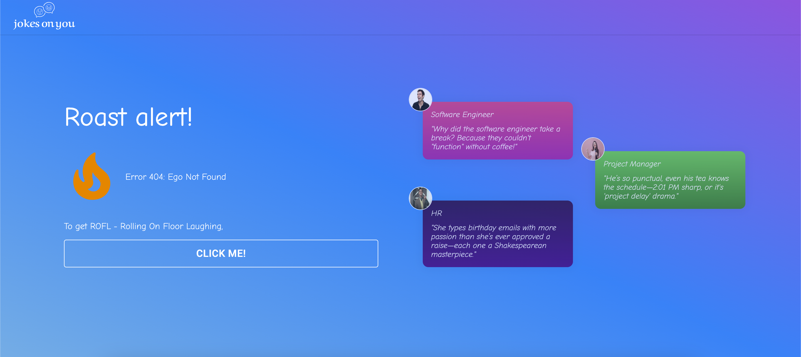
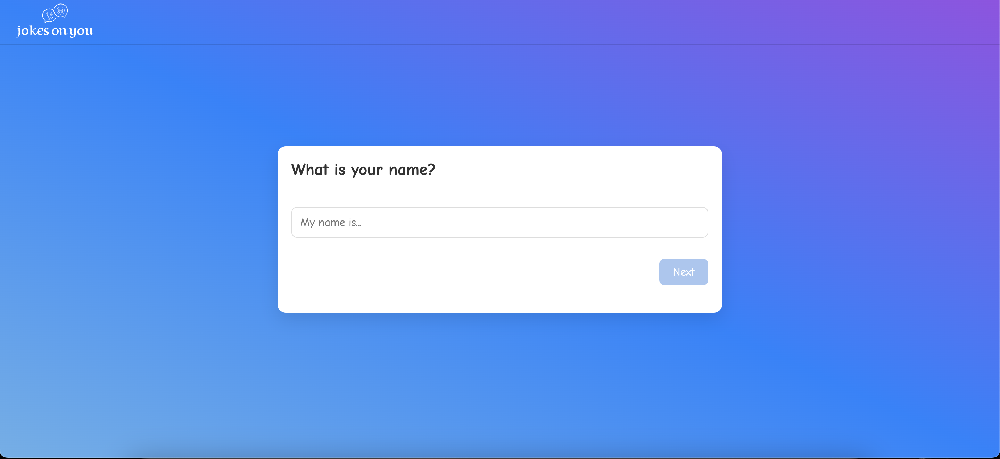
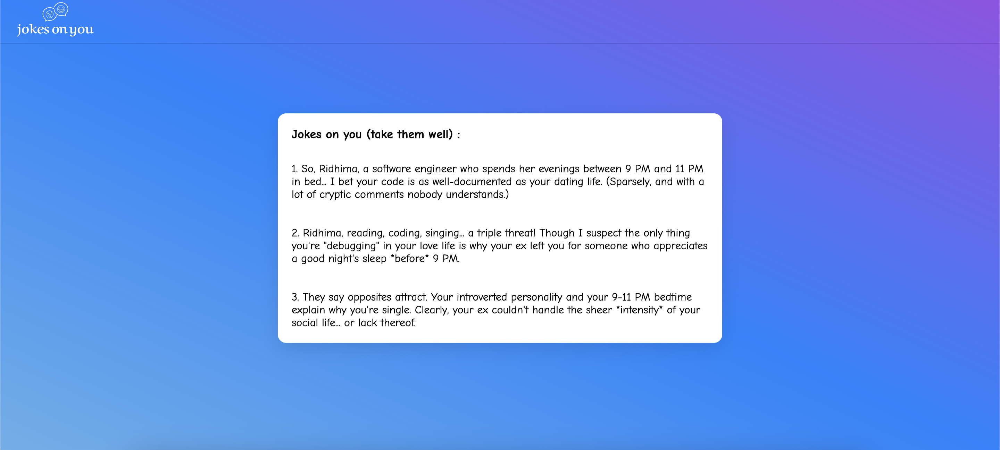

# MakeJokesOnYou - The Ultimate Roast App 🔥

Have you ever wondered what it feels like to get roasted by a witty AI? Look no further! **MakeJokesOnYou** is a fun project designed to entertain (and roast) users based on the information they fill in a form.  

## ✨ Features  
- **Interactive Form:** Users fill out a form with their information.  
- **AI-Powered Roasts:** The app generates hilarious and personalized roasts using the **Gemini API**.  
- **Modern UI:** Built with **Material-UI**, providing a sleek and responsive design.  
- **ReactJS Frontend:** Ensuring smooth interactions and real-time updates.  

## 🚀 Try it Out  
👉 **[Live Demo](https://www.makejokesonyou.club/)**  

Experience the fun firsthand at **[makejokesonyou.club](https://www.makejokesonyou.club/)**!  

## 🛠️ Tech Stack  
- **ReactJS**: For building the interactive and dynamic user interface.  
- **Gemini API**: To generate witty and sarcastic roasts.  
- **Material-UI**: For stylish and user-friendly components.  

## Home page 

## Fill out the form

## Jokes

## 🙌 Contributors
[Saksham](https://github.com/sakshamian)

## Contributing
Contributions are welcome! If you would like to contribute to this project, please follow these steps:

1. Fork the repository
2. Create a new branch: git checkout -b my-feature-branch
3. Make your changes and commit them: git commit -am 'Add some feature'
4. Push to the branch: git push origin my-feature-branch
5. Submit a pull request

## Contact
Reach out to me at ridhimakohli19@gmail.com for any questions, feedback, or collaboration opportunities.
   
